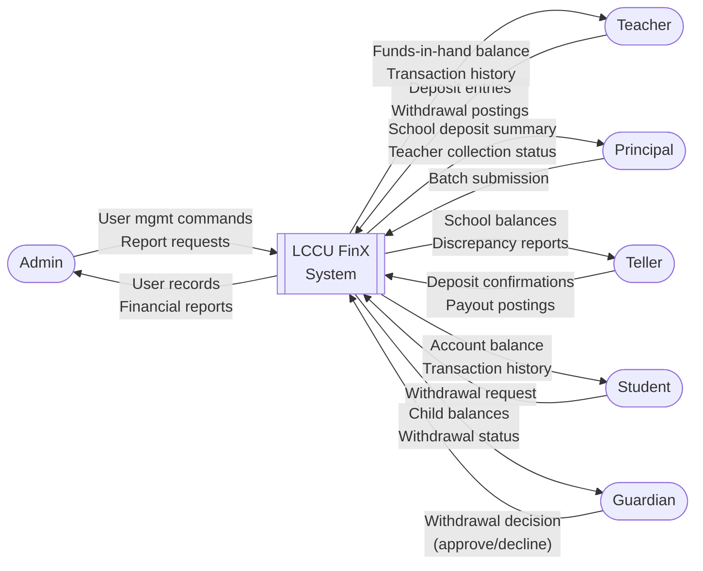
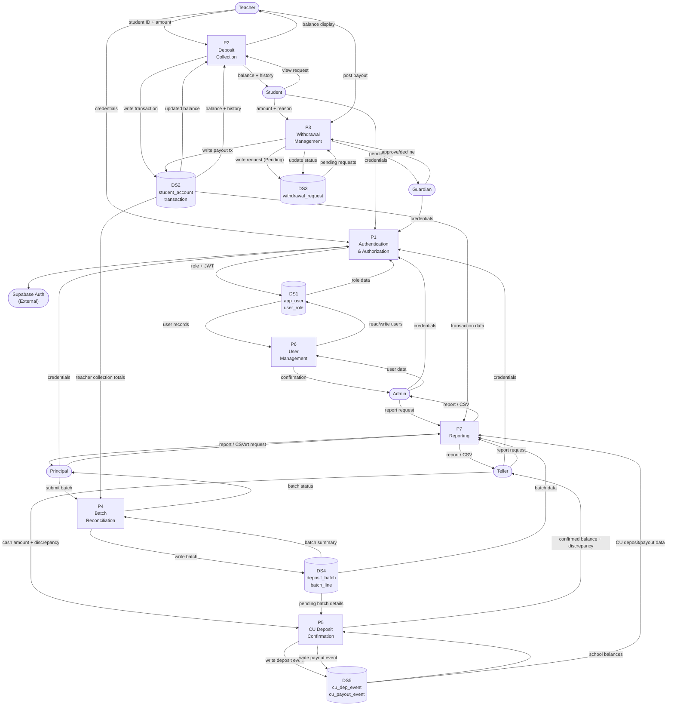
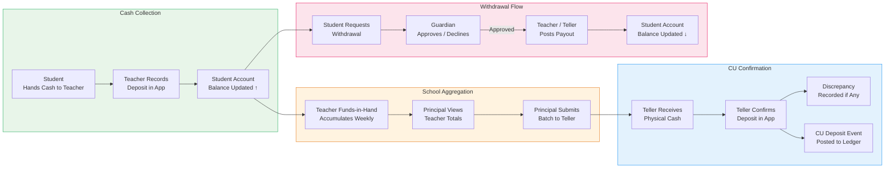

# Data Flow Diagram — LCCU FinX

## Level 0 — Context Diagram

```mermaid
graph LR
    ADMIN(["Admin"])
    TEACHER(["Teacher"])
    PRINCIPAL(["Principal"])
    TELLER(["Teller"])
    STUDENT(["Student"])
    GUARDIAN(["Guardian"])

    SYS[["LCCU FinX\nSystem"]]

    ADMIN -- "User mgmt commands\nReport requests" --> SYS
    SYS -- "User records\nFinancial reports" --> ADMIN

    TEACHER -- "Deposit entries\nWithdrawal postings" --> SYS
    SYS -- "Funds-in-hand balance\nTransaction history" --> TEACHER

    PRINCIPAL -- "Batch submission" --> SYS
    SYS -- "School deposit summary\nTeacher collection status" --> PRINCIPAL

    TELLER -- "Deposit confirmations\nPayout postings" --> SYS
    SYS -- "School balances\nDiscrepancy reports" --> TELLER

    STUDENT -- "Withdrawal request" --> SYS
    SYS -- "Account balance\nTransaction history" --> STUDENT

    GUARDIAN -- "Withdrawal decision\n(approve/decline)" --> SYS
    SYS -- "Child balances\nWithdrawal status" --> GUARDIAN
```

---

## Level 1 — Main Processes

```mermaid
graph TB
    %% External entities
    TEACHER_E(["Teacher"])
    PRINCIPAL_E(["Principal"])
    TELLER_E(["Teller"])
    STUDENT_E(["Student"])
    GUARDIAN_E(["Guardian"])
    ADMIN_E(["Admin"])
    SUPABASE_AUTH(["Supabase Auth\n(External)"])

    %% Processes
    P1["P1\nAuthentication\n& Authorization"]
    P2["P2\nDeposit\nCollection"]
    P3["P3\nWithdrawal\nManagement"]
    P4["P4\nBatch\nReconciliation"]
    P5["P5\nCU Deposit\nConfirmation"]
    P6["P6\nUser\nManagement"]
    P7["P7\nReporting"]

    %% Data stores
    DS1[("DS1\napp_user\nuser_role")]
    DS2[("DS2\nstudent_account\ntransaction")]
    DS3[("DS3\nwithdrawal_request")]
    DS4[("DS4\ndeposit_batch\nbatch_line")]
    DS5[("DS5\ncu_dep_event\ncu_payout_event")]

    %% Auth flows
    TEACHER_E -- "credentials" --> P1
    PRINCIPAL_E -- "credentials" --> P1
    TELLER_E -- "credentials" --> P1
    STUDENT_E -- "credentials" --> P1
    GUARDIAN_E -- "credentials" --> P1
    ADMIN_E -- "credentials" --> P1
    P1 <--> SUPABASE_AUTH
    P1 -- "role + JWT" --> DS1
    DS1 -- "role data" --> P1

    %% Deposit flows
    TEACHER_E -- "student ID + amount" --> P2
    P2 -- "write transaction" --> DS2
    DS2 -- "updated balance" --> P2
    P2 -- "balance display" --> TEACHER_E
    STUDENT_E -- "view request" --> P2
    DS2 -- "balance + history" --> P2
    P2 -- "balance + history" --> STUDENT_E

    %% Withdrawal flows
    STUDENT_E -- "amount + reason" --> P3
    P3 -- "write request (Pending)" --> DS3
    DS3 -- "pending requests" --> P3
    P3 -- "pending list" --> GUARDIAN_E
    GUARDIAN_E -- "approve/decline" --> P3
    P3 -- "update status" --> DS3
    TEACHER_E -- "post payout" --> P3
    P3 -- "write payout tx" --> DS2

    %% Reconciliation flows
    PRINCIPAL_E -- "submit batch" --> P4
    DS2 -- "teacher collection totals" --> P4
    P4 -- "write batch" --> DS4
    DS4 -- "batch summary" --> P4
    P4 -- "batch status" --> PRINCIPAL_E

    %% CU deposit flows
    TELLER_E -- "cash amount + discrepancy" --> P5
    DS4 -- "pending batch details" --> P5
    P5 -- "write deposit event" --> DS5
    P5 -- "write payout event" --> DS5
    DS5 -- "school balances" --> P5
    P5 -- "confirmed balance + discrepancy" --> TELLER_E

    %% User management flows
    ADMIN_E -- "user data" --> P6
    P6 -- "read/write users" --> DS1
    DS1 -- "user records" --> P6
    P6 -- "confirmation" --> ADMIN_E

    %% Reporting flows
    ADMIN_E -- "report request" --> P7
    TELLER_E -- "report request" --> P7
    PRINCIPAL_E -- "report request" --> P7
    DS2 -- "transaction data" --> P7
    DS4 -- "batch data" --> P7
    DS5 -- "CU deposit/payout data" --> P7
    P7 -- "report / CSV" --> ADMIN_E
    P7 -- "report / CSV" --> TELLER_E
    P7 -- "report / CSV" --> PRINCIPAL_E
```

---

## Level 2 — Cash Flow Through the System

```mermaid
flowchart LR
    subgraph COLLECTION["Cash Collection"]
        STU_CASH["Student\nHands Cash to Teacher"]
        TEACHER_RECORD["Teacher Records\nDeposit in App"]
        STU_ACCOUNT["Student Account\nBalance Updated ↑"]
    end

    subgraph AGGREGATION["School Aggregation"]
        TEACHER_BALANCE["Teacher Funds-in-Hand\nAccumulates Weekly"]
        PRINCIPAL_VIEW["Principal Views\nTeacher Totals"]
        PRINCIPAL_SUBMIT["Principal Submits\nBatch to Teller"]
    end

    subgraph CONFIRMATION["CU Confirmation"]
        TELLER_RECEIVE["Teller Receives\nPhysical Cash"]
        TELLER_CONFIRM["Teller Confirms\nDeposit in App"]
        DISCREPANCY["Discrepancy\nRecorded if Any"]
        CU_LEDGER["CU Deposit Event\nPosted to Ledger"]
    end

    subgraph WITHDRAWAL["Withdrawal Flow"]
        STU_REQ["Student Requests\nWithdrawal"]
        GUARD_DECISION["Guardian\nApproves / Declines"]
        TEACHER_PAYOUT["Teacher / Teller\nPosts Payout"]
        STU_BALANCE_DOWN["Student Account\nBalance Updated ↓"]
    end

    STU_CASH --> TEACHER_RECORD --> STU_ACCOUNT
    STU_ACCOUNT --> TEACHER_BALANCE
    TEACHER_BALANCE --> PRINCIPAL_VIEW --> PRINCIPAL_SUBMIT
    PRINCIPAL_SUBMIT --> TELLER_RECEIVE --> TELLER_CONFIRM
    TELLER_CONFIRM --> DISCREPANCY
    TELLER_CONFIRM --> CU_LEDGER

    STU_ACCOUNT --> STU_REQ --> GUARD_DECISION
    GUARD_DECISION -->|Approved| TEACHER_PAYOUT --> STU_BALANCE_DOWN

    style COLLECTION fill:#e8f5e9,stroke:#27ae60
    style AGGREGATION fill:#fff3e0,stroke:#e67e22
    style CONFIRMATION fill:#e3f2fd,stroke:#2196f3
    style WITHDRAWAL fill:#fce4ec,stroke:#e91e63
```
