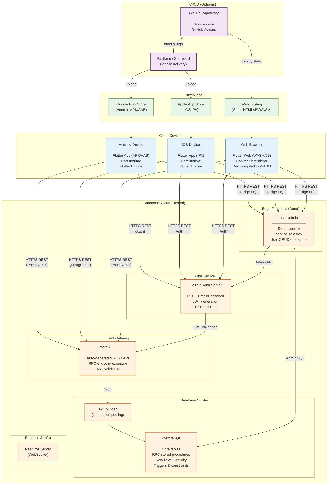

# Deployment Diagram — LCCU FinX

## Deployment Environments

| Environment | Host | URL |
|---|---|---|
| **Production DB** | Supabase Cloud | `https://juzpizqbhxkncxfpdlxd.supabase.co` |
| **Edge Functions** | Supabase Deno (same project) | `/functions/v1/user-admin` |
| **Android App** | Google Play Store / Direct APK | — |
| **iOS App** | Apple App Store | — |
| **Web App** | Static hosting (e.g., Vercel / Netlify / Firebase Hosting) | — |

## Network Security

| Concern | Mitigation |
|---|---|
| **Transport** | All communication over HTTPS/TLS |
| **Auth** | PKCE flow; JWTs expire; refresh tokens rotated |
| **Privilege escalation** | `service_role` key only in Edge Functions (server-side), never in client |
| **Data isolation** | PostgreSQL Row Level Security enforces per-role data access |
| **Admin operations** | Only executed via authenticated Edge Function, never direct DB from client |

## Infrastructure Notes

- **No dedicated app server** — Supabase acts as the full backend (BaaS)
- **Edge Functions** run on Deno at the Supabase edge (CDN-adjacent)
- **Database** is managed PostgreSQL with automatic backups on Supabase's infrastructure
- **Realtime** WebSocket connections available but not currently used (polling via RPC instead)
