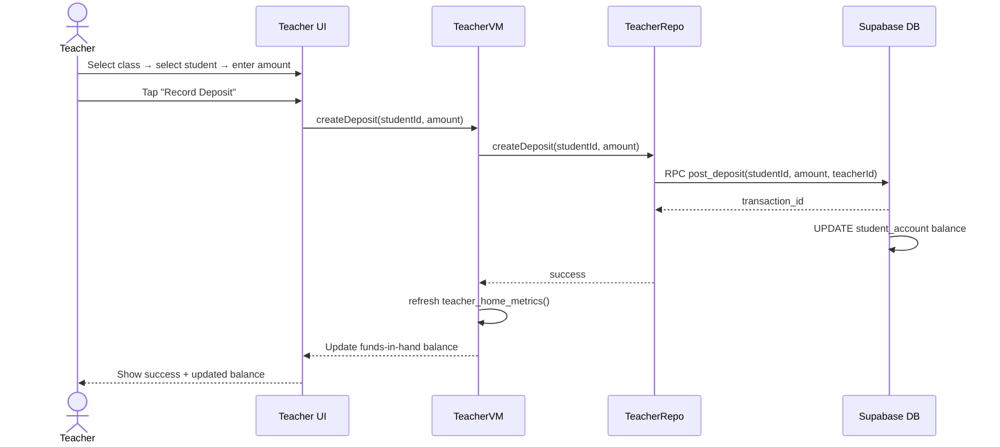
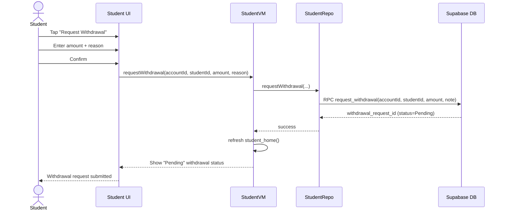
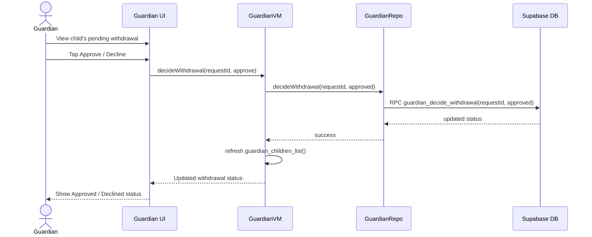
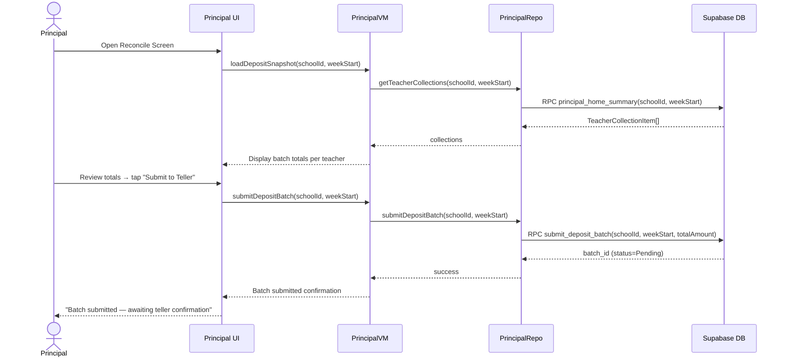
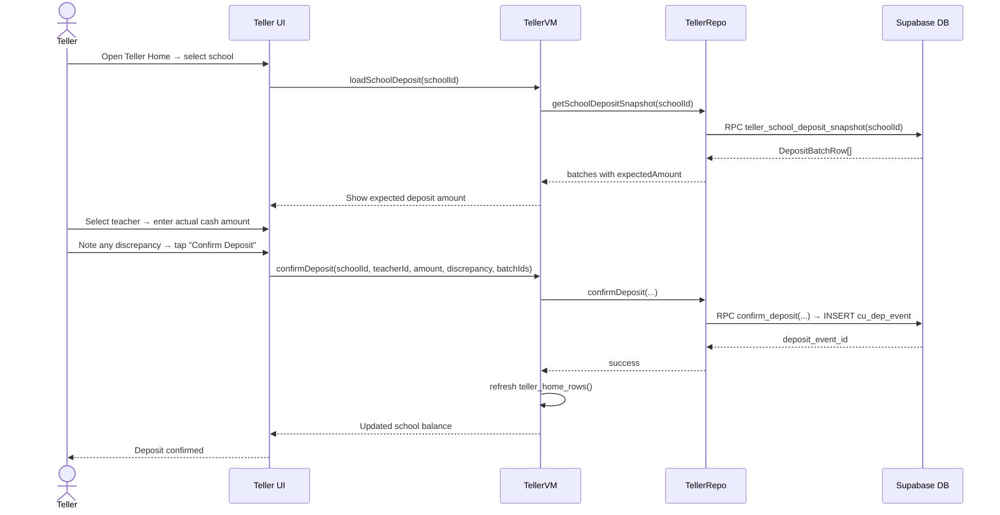
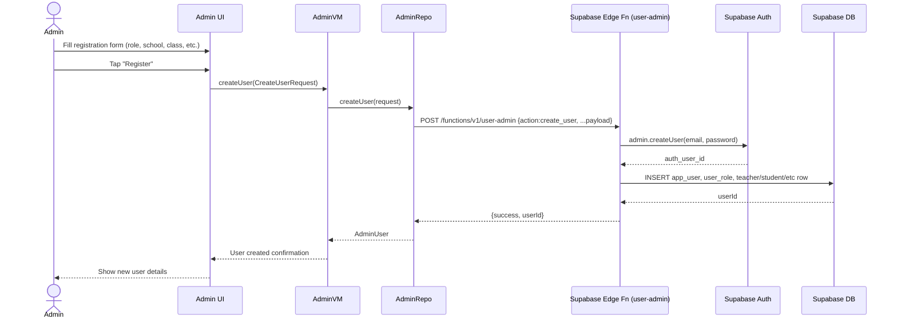

# Sequence Diagrams — LCCU FinX

## 1. Authentication & Role Resolution

```mermaid
sequenceDiagram
    actor User
    participant App as Flutter App
    participant AuthGate
    participant Supabase as Supabase Auth
    participant DB as Supabase DB (RPC)

    User->>App: Launch app
    App->>App: SplashScreen: clear local sign-in state
    App->>Supabase: Check existing session
    Supabase-->>App: No session → show LoginPage

    User->>App: Enter email + password
    App->>Supabase: signInWithPassword(email, password)
    Supabase-->>App: AuthSession (access token)

    App->>AuthGate: onAuthStateChange event
    AuthGate->>DB: RPC f_me_role(userId)
    DB-->>AuthGate: [AppRole]
    AuthGate->>App: Route to role-specific home screen

    Note over App,DB: Timeout = 8 seconds; on timeout → LoginPage
```

---

## 2. Teacher Records a Student Deposit



---

## 3. Student Requests a Withdrawal



---

## 4. Guardian Approves/Declines Withdrawal



---

## 5. Principal Submits Deposit Batch to Teller



---

## 6. Teller Confirms Deposit from Principal Batch



---

## 7. Admin Creates a New User


