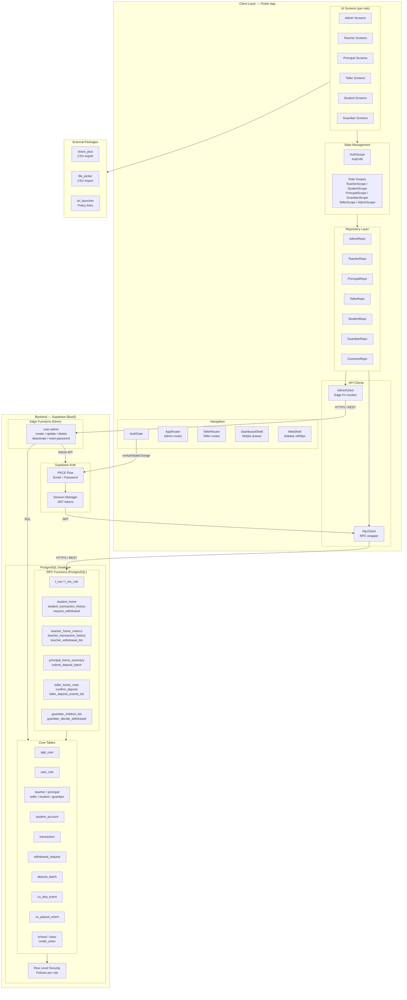

# System Architecture Diagram — LCCU FinX

## Component Responsibilities

| Component | Responsibility |
|---|---|
| **AuthScope / AuthVM** | Listens to Supabase auth state changes; resolves user role; provides auth context to entire widget tree |
| **Role Scopes** | `InheritedNotifier` wrappers that provide role-specific `ChangeNotifier` ViewModels to the widget subtree |
| **Repository Layer** | All Supabase data access; maps raw JSON to typed Dart models; no UI logic |
| **RpcClient** | Thin wrapper around `supabase.rpc()` with typed list/single helpers |
| **AdminClient** | Invokes the `user-admin` Edge Function for privileged user management |
| **AppRouter / TellerRouter** | `Navigator` stacks with named routes for admin and teller flows |
| **DashboardShell / WebShell** | Responsive layout: hamburger drawer (mobile) vs. sidebar (web ≥ 900 px) |
| **Supabase Auth (PKCE)** | Passwordless-safe OAuth-style flow; email/password login; OTP password reset |
| **Edge Function: user-admin** | Server-side privileged admin operations requiring `service_role` key (never exposed to client) |
| **RPC Functions** | PostgreSQL stored procedures enforcing business logic and row-level security |
| **Row Level Security** | Supabase RLS policies ensure users can only access data belonging to their role/school/class |
