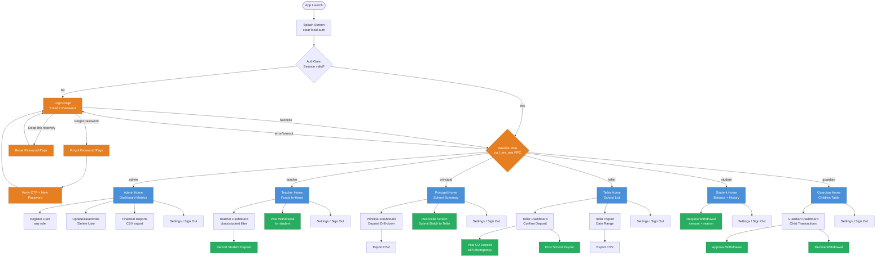

# User Flow Diagram — LCCU FinX

```mermaid
flowchart TD
    START([App Launch]) --> SPLASH[Splash Screen\nclear local auth]
    SPLASH --> AUTHGATE{AuthGate:\nSession valid?}

    AUTHGATE -- No --> LOGIN[Login Page\nEmail + Password]
    LOGIN -- Forgot password --> FORGOT[Forgot Password Page]
    FORGOT --> OTP[Verify OTP + New Password]
    OTP --> LOGIN
    LOGIN -- Deep link recovery --> RESET[Reset Password Page]
    RESET --> LOGIN

    AUTHGATE -- Yes --> ROLERESOLVE{Resolve Role\nvia f_me_role RPC}
    LOGIN -- Success --> ROLERESOLVE

    ROLERESOLVE -- admin --> ADMINHOME[Admin Home\nDashboard Metrics]
    ROLERESOLVE -- teacher --> TEACHERHOME[Teacher Home\nFunds In-Hand]
    ROLERESOLVE -- principal --> PRINCIPALHOME[Principal Home\nSchool Summary]
    ROLERESOLVE -- teller --> TELLERHOME[Teller Home\nSchool List]
    ROLERESOLVE -- student --> STUDENTHOME[Student Home\nBalance + History]
    ROLERESOLVE -- guardian --> GUARDIANHOME[Guardian Home\nChildren Table]
    ROLERESOLVE -- error/timeout --> LOGIN

    %% Admin flows
    ADMINHOME --> ADMINREGISTER[Register User\nany role]
    ADMINHOME --> ADMINUPDATE[Update/Deactivate\n/Delete User]
    ADMINHOME --> ADMINREPORT[Financial Reports\nCSV export]
    ADMINHOME --> ADMINSETTINGS[Settings / Sign Out]

    %% Teacher flows
    TEACHERHOME --> TEACHERDASH[Teacher Dashboard\nclass/student filter]
    TEACHERDASH --> TEACHERDEPOSIT[Record Student Deposit]
    TEACHERHOME --> TEACHERWITHDRAW[Post Withdrawal\nfor student]
    TEACHERHOME --> TEACHERSETTINGS[Settings / Sign Out]

    %% Principal flows
    PRINCIPALHOME --> PRINCIPALDASH[Principal Dashboard\nDeposit Drill-down]
    PRINCIPALDASH --> PRINCIPALEXPORT[Export CSV]
    PRINCIPALHOME --> PRINCIPALRECONCILE[Reconcile Screen\nSubmit Batch to Teller]
    PRINCIPALHOME --> PRINCIPALSETTINGS[Settings / Sign Out]

    %% Teller flows
    TELLERHOME --> TELLERDASH[Teller Dashboard\nConfirm Deposit]
    TELLERDASH --> TELLERDEPOSIT[Post CU Deposit\nwith discrepancy]
    TELLERDASH --> TELLERPAYOUT[Post School Payout]
    TELLERHOME --> TELLERREPORT[Teller Report\nDate Range]
    TELLERREPORT --> TELLEREXPORT[Export CSV]
    TELLERHOME --> TELLERSETTINGS[Settings / Sign Out]

    %% Student flows
    STUDENTHOME --> STUDENTWITHDRAW[Request Withdrawal\namount + reason]
    STUDENTHOME --> STUDENTSETTINGS[Settings / Sign Out]

    %% Guardian flows
    GUARDIANHOME --> GUARDIANDASH[Guardian Dashboard\nChild Transactions]
    GUARDIANDASH --> GUARDIANAPPROVE[Approve Withdrawal]
    GUARDIANDASH --> GUARDIANDECLINE[Decline Withdrawal]
    GUARDIANHOME --> GUARDIANSETTINGS[Settings / Sign Out]

    %% Styling
    classDef role fill:#4A90D9,stroke:#2c5f8a,color:#fff
    classDef action fill:#27AE60,stroke:#1a7a42,color:#fff
    classDef auth fill:#E67E22,stroke:#b35c0c,color:#fff
    class ADMINHOME,TEACHERHOME,PRINCIPALHOME,TELLERHOME,STUDENTHOME,GUARDIANHOME role
    class TEACHERDEPOSIT,TEACHERWITHDRAW,TELLERDEPOSIT,TELLERPAYOUT,STUDENTWITHDRAW,GUARDIANAPPROVE,GUARDIANDECLINE,PRINCIPALRECONCILE action
    class LOGIN,FORGOT,OTP,RESET,ROLERESOLVE auth
```
