# Use Case Diagram — LCCU FinX

```mermaid
graph LR
    %% Actors
    ADMIN(["👤 Admin"])
    TEACHER(["👤 Teacher"])
    PRINCIPAL(["👤 Principal"])
    TELLER(["👤 Teller"])
    STUDENT(["👤 Student"])
    GUARDIAN(["👤 Guardian"])
    SYSTEM(["⚙️ System"])

    %% Auth use cases (shared)
    subgraph AUTH["Authentication"]
        UC_LOGIN["Login with Email\n& Password"]
        UC_FORGOT["Reset Password\n(OTP)"]
        UC_SIGNOUT["Sign Out"]
    end

    %% Admin use cases
    subgraph ADMINUC["Admin Use Cases"]
        UC_CREATE["Create User\n(any role)"]
        UC_BULKIMPORT["Bulk Import Users\n(CSV)"]
        UC_EDITUSER["Edit User Details"]
        UC_DEACTIVATE["Deactivate / Reactivate\nUser"]
        UC_DELETEUSER["Delete User"]
        UC_ADMINREPORT["Generate Financial\nReports"]
        UC_VIEWMETRICS["View Dashboard\nMetrics"]
    end

    %% Teacher use cases
    subgraph TEACHERUC["Teacher Use Cases"]
        UC_RECORDDEPOSIT["Record Student\nDeposit (cash)"]
        UC_VIEWBALANCE["View Funds\nIn-Hand"]
        UC_TEACHERHISTORY["View Transaction\nHistory"]
        UC_POSTWITHDRAWAL["Post Student\nWithdrawal Payout"]
    end

    %% Principal use cases
    subgraph PRINCIPALUC["Principal Use Cases"]
        UC_SCHOOLSUMMARY["View School\nDeposit Summary"]
        UC_DRILLDOWN["Drill Down by\nTeacher / Class"]
        UC_SUBMITBATCH["Submit Deposit\nBatch to Teller"]
        UC_EXPORTCSV_P["Export Report CSV"]
    end

    %% Teller use cases
    subgraph TELLERUC["Teller Use Cases"]
        UC_VIEWSCHOOLS["View School\nBalances"]
        UC_CONFIRMDEPOSIT["Confirm Physical\nDeposit from School"]
        UC_RECORDDISCREPANCY["Record Deposit\nDiscrepancy"]
        UC_POSTPAYOUT["Post School\nPayout / Withdrawal"]
        UC_TELLERREPORT["Generate Deposit\n& Payout Report"]
        UC_EXPORTCSV_T["Export Report CSV"]
    end

    %% Student use cases
    subgraph STUDENTUC["Student Use Cases"]
        UC_VIEWBALANCE_S["View Account\nBalance"]
        UC_VIEWHISTORY_S["View Transaction\nHistory"]
        UC_REQUESTWITHDRAWAL["Request Withdrawal"]
    end

    %% Guardian use cases
    subgraph GUARDIANUC["Guardian Use Cases"]
        UC_VIEWCHILDREN["View Children's\nAccounts"]
        UC_GUARDIANTX["View Child\nTransactions"]
        UC_APPROVEWD["Approve Child\nWithdrawal"]
        UC_DECLINEWD["Decline Child\nWithdrawal"]
    end

    %% System use cases
    subgraph SYSTEMUC["System Use Cases"]
        UC_ROLERESOLUTION["Resolve User Role\non Login"]
        UC_RLS["Enforce Row Level\nSecurity (RLS)"]
        UC_NOTIFY["Reflect Balance\nChanges in Real Time"]
    end

    %% Actor → Use Case links
    ADMIN --> UC_LOGIN
    ADMIN --> UC_CREATE
    ADMIN --> UC_BULKIMPORT
    ADMIN --> UC_EDITUSER
    ADMIN --> UC_DEACTIVATE
    ADMIN --> UC_DELETEUSER
    ADMIN --> UC_ADMINREPORT
    ADMIN --> UC_VIEWMETRICS
    ADMIN --> UC_SIGNOUT

    TEACHER --> UC_LOGIN
    TEACHER --> UC_RECORDDEPOSIT
    TEACHER --> UC_VIEWBALANCE
    TEACHER --> UC_TEACHERHISTORY
    TEACHER --> UC_POSTWITHDRAWAL
    TEACHER --> UC_SIGNOUT

    PRINCIPAL --> UC_LOGIN
    PRINCIPAL --> UC_SCHOOLSUMMARY
    PRINCIPAL --> UC_DRILLDOWN
    PRINCIPAL --> UC_SUBMITBATCH
    PRINCIPAL --> UC_EXPORTCSV_P
    PRINCIPAL --> UC_SIGNOUT

    TELLER --> UC_LOGIN
    TELLER --> UC_VIEWSCHOOLS
    TELLER --> UC_CONFIRMDEPOSIT
    TELLER --> UC_RECORDDISCREPANCY
    TELLER --> UC_POSTPAYOUT
    TELLER --> UC_TELLERREPORT
    TELLER --> UC_EXPORTCSV_T
    TELLER --> UC_SIGNOUT

    STUDENT --> UC_LOGIN
    STUDENT --> UC_VIEWBALANCE_S
    STUDENT --> UC_VIEWHISTORY_S
    STUDENT --> UC_REQUESTWITHDRAWAL
    STUDENT --> UC_SIGNOUT

    GUARDIAN --> UC_LOGIN
    GUARDIAN --> UC_VIEWCHILDREN
    GUARDIAN --> UC_GUARDIANTX
    GUARDIAN --> UC_APPROVEWD
    GUARDIAN --> UC_DECLINEWD
    GUARDIAN --> UC_SIGNOUT

    SYSTEM --> UC_ROLERESOLUTION
    SYSTEM --> UC_RLS
    SYSTEM --> UC_NOTIFY

    %% Include relationships
    UC_LOGIN -.->|«include»| UC_ROLERESOLUTION
    UC_CONFIRMDEPOSIT -.->|«include»| UC_RECORDDISCREPANCY
    UC_ADMINREPORT -.->|«include»| UC_EXPORTCSV_P
    UC_TELLERREPORT -.->|«include»| UC_EXPORTCSV_T
    UC_RECORDDEPOSIT -.->|«extend»| UC_NOTIFY
    UC_REQUESTWITHDRAWAL -.->|«extend»| UC_NOTIFY

    %% Styling
    style AUTH fill:#f0f4ff,stroke:#7090d0
    style ADMINUC fill:#fff3e0,stroke:#e67e22
    style TEACHERUC fill:#e8f5e9,stroke:#27ae60
    style PRINCIPALUC fill:#fce4ec,stroke:#e91e63
    style TELLERUC fill:#e3f2fd,stroke:#2196f3
    style STUDENTUC fill:#f3e5f5,stroke:#9c27b0
    style GUARDIANUC fill:#fff8e1,stroke:#ffc107
    style SYSTEMUC fill:#efebe9,stroke:#795548
```

## Summary Table

| Actor | Primary Use Cases |
|---|---|
| **Admin** | Full user lifecycle management (CRUD), financial reporting, bulk import |
| **Teacher** | Record student cash deposits, view funds-in-hand, post withdrawals |
| **Principal** | View school deposit summary, drill-down by teacher/class, submit weekly batch |
| **Teller** | Confirm physical deposits, record discrepancies, post payouts, generate reports |
| **Student** | View balance & history, request withdrawal |
| **Guardian** | View children's balances & transactions, approve/decline withdrawals |
| **System** | Role resolution on login, RLS enforcement, balance updates |
